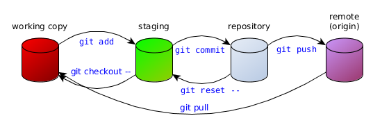

# Git, niet enkel voor programmeurs

### Bert Van Vreckem

### 2018-05-25

+++

## `whoami`

- Bert Van Vreckem
- *Lector ICT* Hogeschool Gent
    - Professionele bachelor toegepaste informatica
    - Linux, onderzoekstechnieken, stage en bachelorproef, ...
- *Open source* contributor: <https://github.com/bertvv/>

+++

## Over Git

Git is een *gedistribueerd* versiebeheersysteem

* Opvolgen van wijzigingen doorheen de tijd
* Opvolgen wie wat doet
* Elk teamlid kan onafhankelijk werken
* Tekst, geen binaire bestanden

+++

## Over Git

* Geschreven door Linus Torvalds, voor Linux Kernelproject (2005)
* Schaalbaar, bv. Linux kernel:
    * 15M+ lijnen code,
    * 12K+ commits,
    * 1300+ developers
* Snapshots, geen diffs
* Data-integriteit is gewaarborgd (revisie-id = checksum)

---?image=assets/demotivational-git.jpg&size=auto 70%

---

# Git leren kennen

+++

## Software

* Git client: [http://git-scm.com/download/](http://git-scm.com/download/)
    * Incl. "Git Bash"
* Evt. grafische tool: [http://git-scm.com/downloads/guis](http://git-scm.com/downloads/guis)
    * bv. [Github Desktop](https://desktop.github.com/)

+++

## Grafisch vs. tekst

Er bestaan grafische tools, waarom command-line?

* instructies zijn éénduidig en compact
* makkelijker reproduceerbaar
* beter zicht op werking
* heel goede info-/foutboodschappen

+++

## Informatiebronnen

* [Visual Git Cheat Sheet](http://ndpsoftware.com/git-cheatsheet.html)
* [`giteveryday`](http://git-scm.com/docs/giteveryday) (basiscommando's)
* [Visualizing Git Concepts with D3](https://onlywei.github.io/explain-git-with-d3/)
* [Reference](http://git-scm.com/docs) ("man pages")

+++

## Enkele algemene instellingen

```
git config --global user.name "Lene Van Vreckem"
git config --global user.email "lene.vanvreckem@gmail.com"
git config --global push.default simple
```

+++

# Git solo

+++

## Initialiseer repository

```bash
$ mkdir my_project
$ cd my_project/
$ git init
Initialized empty Git repository in /home/bert/linux/my_project/.git/
$ git status
On branch master

Initial commit

nothing to commit (create/copy files and use "git add" to track)
```

+++

## Werkomgeving

* @color[#006FB8](Working copy)
    * de directorystructuur en bestanden waarin je wijzigingen aanbrengt
* @color[#006FB8](Staging)
    * "Tussenstation" tussen *working copy* en *repository*
    * Laat toe wijzigingen selectief te *committen*
* @color[#006FB8](Repository)
    * Verzameling van alle commits, branches, tags, ...

+++

## `git status`

- Het belangrijkste commando!
- Toont huidige toestand
- Volgende stap
- Hoe een stap terug zetten

+++

## Workflow


+++

Bestand(en) aanmaken of wijzigen:

```bash
$ vi README.md
$ git status
On branch master

Initial commit

Untracked files:
  (use "git add <file>..." to include in what will be committed)

  README.md

nothing added to commit but untracked files present (use "git add" to track)
```

+++

Bestand naar @color[#006FB8](staging) verplaatsen: `git add`

```bash
$ git add README.md
$ git status
On branch master

Initial commit

Changes to be committed:
  (use "git rm --cached <file>..." to unstage)

  new file:   README.md
```

+++

Wijzigingen doorvoeren: `git commit`

```bash
$ git commit -m "README toegevoegd"
[master (root-commit) aadfd67] README toegevoegd
 1 file changed, 3 insertions(+)
 create mode 100644 README.md
$ git status
On branch master
nothing to commit, working directory clean
```

+++

## Workflow voor één persoon

```bash
$ git status
$ git add .
$ git commit -m "Beschrijving van de wijzigingen"
```

- `.` is de huidige directory (incl. onderliggende)
- Je kan ook bestanden individueel toevoegen
- **Let op!** Werkt enkel *binnen* de directory met repository

+++

## Ctrl-Z!

* Je kan (zo goed als) elke stap ongedaan maken!
* Lokale wijzigingen aan `README.md` ongedaan maken:

    ```bash
    git checkout -- README.md
    ```

* `README.md` opnieuw uit `staging` halen :

    ```bash
    git reset HEAD README.md
    ```

* `git status` herinnert telkens aan deze commando's!

+++

## Wijzigingen bekijken

Wijzigingen van *working copy* t.o.v. *repository*:

```diff
$ git diff
diff --git a/README.md b/README.md
index ea596b8..3d13212 100644
--- a/README.md
+++ b/README.md
@@ -1,3 +1,5 @@
# README

Dit is mijn eerste Git repository!
+
+Deze lijn is gewijzigd
```

+++

## Historiek

```none
$ git log
commit 97deea303754171c717291387af87e9b891f28fb
Author: Bert Van Vreckem <bert.vanvreckem@gmail.com>
Date:   Sat Nov 15 16:50:20 2014 +0100

    Added .gitignore

commit aadfd674f5dec9205fde484a5d921041b256b135
Author: Bert Van Vreckem <bert.vanvreckem@gmail.com>
Date:   Sat Nov 15 14:47:46 2014 +0100

    README toegevoegd

$ git log --pretty="format:%C(yellow)%h %C(blue)%ad %C(reset)%s%C(red)%d
    %C(green)%an%C(reset), %C(cyan)%ar" --date=short --graph --all
* 97deea3 2014-11-15 Added .gitignore (HEAD, master) Bert Van Vreckem, 22 minutes ago
* aadfd67 2014-11-15 README toegevoegd Bert Van Vreckem, 2 hours ago
```

+++

## Markdown

[daringfireball.net/projects/markdown/](https://daringfireball.net/projects/markdown/)

* "Opgemaakte" tekst, radicaal eenvoudig
* Github toont dit als HTML-webpagina
    * vet, cursief, links
    * tabellen, afbeeldingen
    * codevoorbeelden met syntaxkleuren
    * ...
* [Github flavored Markdown](https://help.github.com/articles/github-flavored-markdown/)

+++

## Markdown

Kan omgezet worden in andere formaten met bv. [Pandoc](http://johnmacfarlane.net/pandoc/)

* Wiki
* Presentatie: Gitpitch, Reveal.js
* PDF
* OpenDocument, Office Open XML

---

# Werken met Github

+++

## Workflow



+++

## Github

[https://github.com/](https://github.com/)

* Bekendste hosting-provider voor Git repositories
* Gratis voor open source
* Gratis voor educatief gebruik (zie verder)
* Niet beschikbaar in Nederlands...

+++

## Github account

* Maak een Github-account aan
    * koppel aan emailadres van je school
* Registreer je op GitHub Education: <https://education.github.com/teachers>
* Maak nieuwe Github "organisatie" aan
    * vb. naam van je school of vak
* Vraag "korting" aan: <https://education.github.com/discount_requests/new>

+++

## Repository aanmaken

Maak op Github een nieuwe repository aan (bv. `my_project`)

* Evt. "Initialize this repository with a README"
* Website wordt: `https://github.com/USER/PROJECT`
* Repo url (https) wordt: `https://github.com/USER/PROJECT.git`
* Repo url (**ssh**) wordt: `git@github.com:USER/PROJECT.git`
    * Zie verder

+++

## Lokale kopie maken

1. Klik groene knop "Clone or download", kopieer url
2. Open commando-prompt (Git Bash)
3. `git clone https://github.com/bertvv/my_project.git`

+++

## Lokale kopie maken

```console
$ git clone https://github.com/bertvv/my_project.git
Cloning into 'my_project'...
remote: Counting objects: 9, done.
remote: Compressing objects: 100% (6/6), done.
Receiving objects: 100% (9/9), done.
remote: Total 9 (delta 0), reused 9 (delta 0)
Checking connectivity... done.
```

+++

## Github workflow voor één persoon

```bash
$ git pull
[bewerk bestanden]
$ git status
$ git add .
$ git commit -m "Beschrijving van de wijzigingen"
$ git push
```

- `pull`: Wijzigingen Github -> lokaal
- `push`: Wijzigingen lokaal -> Github

---

# Werken in team

+++

## Anderen toegang geven tot je repository

* Klik rechts op **Settings**
* In het menu links, klik op **Collaborators**
* Voeg de gebruikersnamen toe van wie toegang moet krijgen

+++

## Een project opzetten in GitHub

* Eén persoon doet:
    * Aanmaken nieuwe repository
    * Optie voor creëeren README + `.gitignore` aanvinken
    * Teamleden toevoegen
* Iedereen doet
    * `git clone https://github.com/USER/PROJECT.git`

+++


+++

## Workflow: werken in een team

* Haal laatste revisie binnen: `git pull --rebase`
* Maak wijzigingen: `git add`, `git commit`
* Nogmaals: `git pull --rebase`
* Naar centrale repository: `git push`

`--rebase` zorgt voor "eenvoudige" historiek

+++

## Demo

Bert en Lene werken samen aan een project. Als dat maar goed afloopt...

* Conflicten oplossen
* `git pull --rebase`
* `git push`

---

# Github in de klas

+++

## Voorbeeld

Jaarwerk Fien Keersse (14j):

- Github: <https://github.com/bloemenmeisje/jaarwerk-klas8>
- Presentatie: <https://gitpitch.com/bloemenmeisje/jaarwerk-klas8/master?grs=github&t=moon>

+++

## Voorbeeld: presentatie

<https://github.com/bertvv/presentation-el7-basics>

- Context: Presentatie basiscommando's Linux
- Presentatie in Markdown
    - Gepubliceerd met Github Pages
- Demo-omgeving: virtuele machine

## Voorbeeld: workshop

<https://github.com/bertvv/vagrant-presentation>

- Context: Workshop over Vagrant
- Presentatie in Markdown, Github Pages
- Aparte repo met codevoorbeelden:
    - <https://github.com/bertvv/vagrant-example>
    - "[Checkpoints](https://github.com/bertvv/vagrant-example/releases)" via `git tag`

+++

## Voorbeeld: elektronische cursus

<https://bertvv.github.io/linux-network-troubleshooting/>

- Context: onderdeel cursus Enterprise Linux
- Inhoud in Markdown
- Gepubliceerd via Github Pages

+++

## Voorbeeld: cursus

<https://github.com/HoGentTIN/onderzoekstechnieken-cursus>

- Context: Cursus onderzoekstechnieken/statistiek
- Cursus in [LaTeX](https://www.latex-project.org/)
- Codevoorbeelden statistische software (R)
- Samenwerken met collega's aan de cursus
- Studenten krijgen toegang, zien verbeteringen doorheen het semester

+++

## Voorbeeld: labo-opgave

<https://github.com/HoGentTIN/ilnx-labos>

- Context: Cursus inleiding Linux
- Labo-opgaven in Markdown
- Oefeningen scripting met unit tests
- Via Github Classroom

+++

## Voorbeeld: labo-opgave (2)

<https://github.com/HoGentTIN/elnx-sme>

- Context: Cursus Enterprise Linux
- Opgave = virtueel netwerk met Linux-servers opzetten
- Raamwerk virtuele omgeving
- Testscripts voor opvolging vooruitgang

+++

## Mogelijkheden

- Feedback geven
    - Via Issues, Pull Requests
- Verbeteringen aanbrengen
    - Online bewerken
- Vooruitgang opvolgen
    - commit log
- Samenwerking team beoordelen

+++

## Github classroom

1. Stel opgave op (Individueel/Groep)
2. Voeg repository met startcode (opgave) toe
3. Geef URL aan de leerlingen
4. Elke leerling/groep krijgt eigen repository

+++

## Demo

---

# Tips en truuks

+++

## Aanbevelingen

* Zo vaak mogelijk committen (*atomair*)
* Geef goede commit-boodschappen
* `git status` voordat je iets doet
* Lees de info-/foutboodschappen

+++

## Aanbevelingen

* Vermijd *artefacten* (automatisch gegenereerde bestanden)
* Vermijd grote/*binaire* bestanden die vaak gewijzigd worden
    * Geen Word-documenten! Gebruik [Markdown](http://daringfireball.net/projects/markdown/)
* Vermijd branches (waar mogelijk)

+++

## Aanbevelingen

Gebruik een goede teksteditor:

- [Sublime Text](https://www.sublimetext.com/)
- [Notepad++](https://notepad-plus-plus.org/)
- [Brackets](http://brackets.io/)
- [Visual Studio Code](https://code.visualstudio.com/)
- [Atom](https://atom.io/)

Hebben typisch ondersteuning voor Markdown, Git

+++

## `.gitignore`

* Negeer bepaalde bestanden in de repository, aan de hand van een patroon
* bv. backup-bestanden, "artefacten", ...

```
*~      # Text editor backups (Linux)
*.bak
build/  # directory with compiled files
```

+++

## `.gitconfig`

In je "home directory"

- Windows, bv. c:\Gebruikers\Bert Van Vreckem\\.gitconfig
- MacOS: /Users/bert/.gitconfig
- Linux: /home/bert/.gitconfig

Voorbeeld, zie <https://github.com/bertvv/dotfiles>

+++

```
[user]
  name = Bert Van Vreckem
  email = bert.vanvreckem@gmail.com
[push]
  default = simple
[github]
  user = bertvv
[credential]
  helper = cache --timeout=3600
[color]
  ui = true
[alias]
  co = checkout
  l = log --pretty='format:%C(yellow)%h %C(blue)%ad %C(reset)%s%C(red)%d %C(green)%an%C(reset), %C(cyan)%ar' --date=short --graph --all
  p = pull --rebase
[core]
	excludesfile = /home/bert/.gitignore_global
    
```

+++

## Tags

"Bladwijzers" in commit history

* `git tag v1.0.0`
* `git tag -m "Release versie 1.0.0" v1.0.0`
* Github: onder "releases"

+++

## SSH-sleutels aanmaken

Zie [https://help.github.com/articles/generating-ssh-keys/](https://help.github.com/articles/generating-ssh-keys/)

* *SSH-sleutel* vervangt wachtwoord
* nieuwe sleutel aanmaken (evt. zonder "pass phrase")
    * In (Git) Bash: ``ssh-keygen -t rsa -C "bert.vanvreckem@hogent.be"``
* Publieke sleutel openen en kopiëren
    * In (Git) Bash: `cat ~/.ssh/id_rsa.pub`

+++

* In Github, klik rechtsboven op het tandwiel
    * Selecteer in het menu links **SSH keys**
    * Klik **Add SSH key**
    * Publieke sleutel plakken in het *Key*-veld
    * Klik **Add key**
* Testen: `ssh -T git@github.com`

+++

```
[lene@jace ~]$ ssh-keygen -t rsa -C "lene@example.com"
Generating public/private rsa key pair.
Enter file in which to save the key (/home/lene/.ssh/id_rsa): [ENTER]
Created directory '/home/lene/.ssh'.
Enter passphrase (empty for no passphrase): [ENTER]
Enter same passphrase again: [ENTER]
Your identification has been saved in /home/lene/.ssh/id_rsa.
Your public key has been saved in /home/lene/.ssh/id_rsa.pub.
The key fingerprint is:
e7:fe:2b:ca:09:87:61:26:90:2a:d1:7f:8c:2c:8b:18 lene@example.com
The key's randomart image is:
+--[ RSA 2048]----+
|                 |
| . .             |
|. +              |
| o + o           |
|E . = * S .      |
|oo o = o o       |
|o .   o . .      |
|       + o.      |
|        +..oo.   |
+-----------------+
[lene@jace ~]$ cat .ssh/id_rsa.pub
ssh-rsa AAAAB3NzaC1yc2EAAAADAQABAAABAQDKGL1YqIK/67bYib2FaVnRVnlTVJHxUq+DtF3e1aDCZYAWzIYK+MTceW1Qg0fuAlYc5qvUCMmSy9eWgnG8jS8PU7DWgOjIbLtbqTLBDwGEUgMNhRc2wHwYiZqIswe9nr4/zMFW4AVd/GpOXiFjTfXZoLCh2m0+NcB5Z1OoiMv3vti1OsMZJ1ECIDZ5QGkju2bhyZpqsQ7FYUZT3CYkCwsKVVZJUoEU09A5DyhakZJedIMO5Qdlinu45qKjQwJr9t5Dw75pRcHarMHVCQJKwIv3wRzO1PImhk45rjHsBGWYPH4bfistbFbTLrWbdPZYlYrk2hI3z15O4TrGHasBPCMx lene@example.com
```

+++

## Lokale Git repository naar Github kopiëren

1. Maak eerst nieuwe repository aan
2. Kopieer de URL (clone or download)

```
$ git remote add origin git@github.com:bertvv/my_project.git
$ git remote -v
 origin git@github.com:bertvv/my_project.git (fetch)
 origin git@github.com:bertvv/my_project.git (push)
$ git push -u origin master
```

+++

## Branching en merging

Branches worden vaak gebruikt in software-ontwikkeling voor:

* Nieuwe features
* Bugfix
* Experimenten

+++

## Commando's

* `git branch NAAM` -- nieuwe branch aanmaken
* `git checkout NAAM` -- naar deze branch overgaan
    * commits gaan naar nieuwe branch
* `git checkout --branch NAAM` -- 2 vorige commando's in 1 keer
    * `-b` kan ook

+++

## Mergen en opruimen

* `git checkout master` -- terug naar de hoofdbranch
* `git merge NAAM` -- wijzigingen uit branch toepassen
* `git branch -d NAAM` -- branch verwijderen
    * `-D` is verwijderen zonder controle op merge

Voorbeeld: [https://onlywei.github.io/explain-git-with-d3/](https://onlywei.github.io/explain-git-with-d3/)

---

# Bedankt!

@fa[twitter] [@bertvanvreckem](https://twitter.com/bertvanvreckem)

@fa[github] <https://github.com/bertvv>

@fa[linkedin] <https://www.linkedin.com/in/bertvanvreckem/>

@fa[envelope] [bert.vanvreckem@hogent.be](mailto:bert.vanvreckem@hogent.be)
