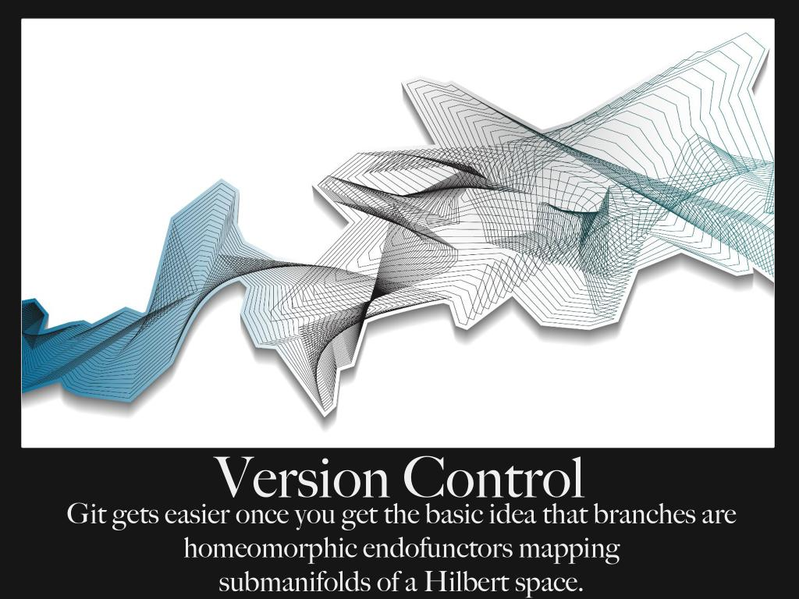

# Workshop Git, niet enkel voor programmeurs

## Bert Van Vreckem

## 2018-05-25

---

## Software

* Git client: [http://git-scm.com/download/](http://git-scm.com/download/)
    * Incl. "Git Bash"
* Evt. GUI: [http://git-scm.com/downloads/guis](http://git-scm.com/downloads/guis)
    * bv. GitHub Desktop for Mac/Windows

---

## CLI vs. GUI

Er bestaan GUI's, waarom CLI?

* éénduidig en compact
* makkelijker reproduceerbaar
* beter zicht op interne werking
* heel goede info-/foutboodschappen

---

## Informatiebronnen

* Chacon & Straub, 2014. [Pro Git](http://git-scm.com/book/en/v2). Apress
* [Reference](http://git-scm.com/docs) ("man pages")
* [Visualizing Git Concepts with D3](https://onlywei.github.io/explain-git-with-d3/)
* [Visual Git Cheat Sheet](http://ndpsoftware.com/git-cheatsheet.html)
* [`giteveryday`](http://git-scm.com/docs/giteveryday)

---

## Over Git

* *Gedistribueerd* versiebeheersysteem
    * commits zijn lokaal
    * synchroniseren tussen "repositories"
* Geschreven door Linus Torvalds, voor Linux Kernelproject (2005)
* Schaalbaar (Linux kernel: >15M LOC, >12K commits, >1300 developers)
* Snapshots, geen diffs
* Data-integriteit is gewaarborgd (revisie-id = checksum)

---



---

## Enkele algemene instellingen

```
git config --global user.name "Lene Van Vreckem"
git config --global user.email "lene.vanvreckem@gmail.com"
git config --global push.default simple
```

+++

# Deel 1: Git leren kennen

---

# Git solo

---

## Initialiseer repository

```bash
$ mkdir my_project
$ cd my_project/
$ git init
Initialized empty Git repository in /home/bert/linux/my_project/.git/
$ git status
On branch master

Initial commit

nothing to commit (create/copy files and use "git add" to track)
```

---

## Werkomgeving

* Working copy
    * de directorystructuur en bestanden waarin je wijzigingen aanbrengt
* Staging
    * "Tussenstation" tussen *working copy* en *repository*
    * Laat toe wijzigingen selectief te *committen*
* Repository
    * Verzameling van alle commits, branches, tags, ...

---

## Workflow


---

Bestand(en) aanmaken of wijzigen:

```bash
$ vi README.md
$ git status
On branch master

Initial commit

Untracked files:
  (use "git add <file>..." to include in what will be committed)

  README.md

nothing added to commit but untracked files present (use "git add" to track)
```

---

Bestand naar staging verplaatsen: `git add`

```bash
$ git add README.md
$ git status
On branch master

Initial commit

Changes to be committed:
  (use "git rm --cached <file>..." to unstage)

  new file:   README.md
```

---

Wijzigingen doorvoeren (*Inchecken*, *committen*): `git commit`

```bash
$ git commit -m "README toegevoegd"
[master (root-commit) aadfd67] README toegevoegd
 1 file changed, 3 insertions(+)
 create mode 100644 README.md
$ git status
On branch master
nothing to commit, working directory clean
```

---

## Ctrl-Z!

* Je kan (zo goed als) elke stap ongedaan maken!
* Lokale wijzigingen aan `README.md` ongedaan maken:

    ```bash
    git checkout -- README.md
    ```

* `README.md` opnieuw uit `staging` halen :

    ```bash
    git reset HEAD README.md
    ```

* `git status` herinnert telkens aan deze commando's!

---

# Tips en truuks

---

## Aanbevelingen

* Zo vaak mogelijk committen (*atomair*)
* Geef goede commit-boodschappen
* `git status` voordat je iets doet
* Lees de foutboodschappen
* Vermijd *artefacten* (automatisch gegenereerde bestanden)
* Vermijd *binaire* bestanden die vaak gewijzigd worden
    * Geen Word-documenten! Gebruik [Markdown](http://daringfireball.net/projects/markdown/)

---

## Markdown

[daringfireball.net/projects/markdown/](https://daringfireball.net/projects/markdown/)

* "Opgemaakte" tekst, radicaal eenvoudig
* Github "rendert" dit als HTML
    * vet, cursief, links, afbeeldingen, syntaxkleuren, ...
    * Herkent verwijzingen naar issues
* Kan omgezet worden in andere formaten met bv. [Pandoc](http://johnmacfarlane.net/pandoc/)
    * vb. Deze presentatie (reveal.js)
    * → LaTeX → PDF
    * OpenDocument, Office Open XML
* Beter dan Office-documenten in Git opslaan...

---

## `.gitignore`

* Negeer bepaalde bestanden in de repository, aan de hand van een patroon
* bv. backup-bestanden, "artefacten", ...

```
*~      # Text editor backups (Linux)
*.bak
build/  # directory with compiled files
```

---

## Wijzigingen bekijken

Wijzigingen van *working copy* t.o.v. *repository*:

```diff
$ git diff
diff --git a/README.md b/README.md
index ea596b8..3d13212 100644
--- a/README.md
+++ b/README.md
@@ -1,3 +1,5 @@
# README

Dit is mijn eerste Git repository!
+
+Deze lijn is gewijzigd
```

---

## Historiek

```none
$ git log
commit 97deea303754171c717291387af87e9b891f28fb
Author: Bert Van Vreckem <bert.vanvreckem@gmail.com>
Date:   Sat Nov 15 16:50:20 2014 +0100

    Added .gitignore

commit aadfd674f5dec9205fde484a5d921041b256b135
Author: Bert Van Vreckem <bert.vanvreckem@gmail.com>
Date:   Sat Nov 15 14:47:46 2014 +0100

    README toegevoegd

$ git log --pretty="format:%C(yellow)%h %C(blue)%ad %C(reset)%s%C(red)%d
    %C(green)%an%C(reset), %C(cyan)%ar"
    --date=short --graph
* 97deea3 2014-11-15 Added .gitignore (HEAD, master) Bert Van Vreckem, 22 minutes ago
* aadfd67 2014-11-15 README toegevoegd Bert Van Vreckem, 2 hours ago
```

---

## Tags

"Bladwijzers" in commit history

* `git tag v1.0.0`
* `git tag -m "Release versie 1.0.0" v1.0.0`

---

# Werken met remotes

---

## Workflow


---

## Github

[https://github.com/](https://github.com/)

* Belangrijkste hosting-provider voor Git repositories
* Gratis voor open source
* Ondersteunen Subversion clients (bv. Visual Paradigm diagrammen?)
* Je kan als leerkracht een gratis afgesloten omgeving ("organisation") aanvragen

---

## Bitbucket

[https://bitbucket.org/](https://bitbucket.org/)

* Goed alternatief voor Github
* Ongelimiteerd private repositories tot 5 teamleden = gratis
* Product van Atlassian

---

## Github account

* Maak een account aan (gebruik hogent.be-emailadres)
* Vraag eventueel het "Student Developer Pack" aan
    * [https://education.github.com/pack](https://education.github.com/pack)
    * o.a. gratis 5 private repositories, $100 hosting-pakket op DigitalOcean

---

## SSH-sleutels aanmaken

Zie [https://help.github.com/articles/generating-ssh-keys/](https://help.github.com/articles/generating-ssh-keys/)

* *SSH-sleutel* vervangt wachtwoord
* nieuwe sleutel aanmaken (evt. zonder "pass phrase")
    * In (Git) Bash: ``ssh-keygen -t rsa -C "bert.vanvreckem@hogent.be"``
* Publieke sleutel openen en kopiëren
    * In (Git) Bash: `cat ~/.ssh/id_rsa.pub`
* In Github, klik rechtsboven op het tandwiel
    * Selecteer in het menu links **SSH keys**
    * Klik **Add SSH key**
    * Publieke sleutel plakken in het *Key*-veld
    * Klik **Add key**
* Testen: `ssh -T git@github.com`

---

```
[lene@jace ~]$ ssh-keygen -t rsa -C "lene@example.com"
Generating public/private rsa key pair.
Enter file in which to save the key (/home/lene/.ssh/id_rsa): [ENTER]
Created directory '/home/lene/.ssh'.
Enter passphrase (empty for no passphrase): [ENTER]
Enter same passphrase again: [ENTER]
Your identification has been saved in /home/lene/.ssh/id_rsa.
Your public key has been saved in /home/lene/.ssh/id_rsa.pub.
The key fingerprint is:
e7:fe:2b:ca:09:87:61:26:90:2a:d1:7f:8c:2c:8b:18 lene@example.com
The key's randomart image is:
+--[ RSA 2048]----+
|                 |
| . .             |
|. +              |
| o + o           |
|E . = * S .      |
|oo o = o o       |
|o .   o . .      |
|       + o.      |
|        +..oo.   |
+-----------------+
[lene@jace ~]$ cat .ssh/id_rsa.pub
ssh-rsa AAAAB3NzaC1yc2EAAAADAQABAAABAQDKGL1YqIK/67bYib2FaVnRVnlTVJHxUq+DtF3e1aDCZYAWzIYK+MTceW1Qg0fuAlYc5qvUCMmSy9eWgnG8jS8PU7DWgOjIbLtbqTLBDwGEUgMNhRc2wHwYiZqIswe9nr4/zMFW4AVd/GpOXiFjTfXZoLCh2m0+NcB5Z1OoiMv3vti1OsMZJ1ECIDZ5QGkju2bhyZpqsQ7FYUZT3CYkCwsKVVZJUoEU09A5DyhakZJedIMO5Qdlinu45qKjQwJr9t5Dw75pRcHarMHVCQJKwIv3wRzO1PImhk45rjHsBGWYPH4bfistbFbTLrWbdPZYlYrk2hI3z15O4TrGHasBPCMx lene@example.com
```

---

## Repository aanmaken

Maak op Github een nieuwe repository aan (bv. `my_project`)

* Website wordt: `https://github.com/USER/PROJECT`
* Repo url (https) wordt: `https://github.com/USER/PROJECT.git`
* Repo url (**ssh**) wordt: `git@github.com:USER/PROJECT.git`

---

## Anderen toegang geven tot je repository

* Klik rechts op **Settings**
* In het menu links, klik op **Collaborators**
* Voeg de gebruikersnamen toe van wie toegang moet krijgen

---

## Lokale repository synchroniseren

```
$ git remote add origin git@github.com:bertvv/my_project.git
$ git remote -v
 origin git@github.com:bertvv/my_project.git (fetch)
 origin git@github.com:bertvv/my_project.git (push)
$ git push -u origin master
```

* De code staat nu op Github!
* Git push: als argumenten "doel" en "bron" opgeven
    * Optie `-u` zorgt dat dat maar één keer moet

---

## Externe repository kopiëren

Stel, je wil verder werken aan het project van iemand anders:

```
$ git clone git@github.com:bertvv/my_project.git
Cloning into 'my_project'...
remote: Counting objects: 9, done.
remote: Compressing objects: 100% (6/6), done.
Receiving objects: 100% (9/9), done.
remote: Total 9 (delta 0), reused 9 (delta 0)
Checking connectivity... done.
```

---

# Werken in team

---

## Een project opzetten in GitHub

* Eén persoon doet:
    * Aanmaken nieuwe repository
    * Optie voor creëeren README + `.gitignore` aanvinken
    * Teamleden (+ begeleider) toevoegen
* Iedereen doet
    * `git clone git@github.com:USER/PROJECT.git`

---


---

## Eenvoudige workflow

* Haal laatste revisie binnen: `git pull`
* Maak wijzigingen: `git add`, `git commit`
* Haal laatste wijzigingen binnen: `git fetch`
* Bekijk wijzigingen van anderen: `git log -p HEAD..FETCH_HEAD`
* Eigen wijzigingen toepassen op versie van server: `git rebase origin/master`
* Mergen en committen
* Naar centrale repository: `git push`

---

## Demo

Bert en Lene werken samen aan een project. Als dat maar goed afloopt...

* Conflicten oplossen
* `git push`, `git pull`
* `git fetch` en `git rebase origin/master`

---

## Nadelen "eenvoudige" workflow

* Veel conflicten
* "master"/"trunk" is moeilijk stabiel te houden
* Duidelijke afspraken in het team nodig!
    * Rol van begeleiders als coach

---

## Branching en merging

Branches zijn goedkoop en eenvoudig, gebruik is sterk aanbevolen

* Nieuwe feature
* Bugfix
* Experimenten

---

## Commando's

* `git branch NAAM` -- nieuwe branch aanmaken
* `git checkout NAAM` -- naar deze branch overgaan
    * commits gaan naar nieuwe branch
* `git checkout --branch NAAM` -- 2 vorige commando's in 1 keer
    * `-b` kan ook

---

## Mergen en opruimen

* `git checkout master` -- terug naar de hoofdbranch
* `git merge NAAM` -- wijzigingen uit branch toepassen
* `git branch -d NAAM` -- branch verwijderen
    * `-D` is verwijderen zonder controle op merge

Voorbeeld: [https://onlywei.github.io/explain-git-with-d3/](https://onlywei.github.io/explain-git-with-d3/)

---

## Branch-strategieën

1. *Niet* branchen: iedereen werkt op `master`
2. Topic branches: voor elke taak een aparte branch:
3. Versie-branches

---

## Niet branchen: pro/con

* Eenvoudigste workflow
* Moeilijk om `master` stabiel (compilerend) te houden

---

## Topic branches

* Geen rechtstreekse commits op `master`, altijd branchen
* Branch-namen geven idee van doel, verwijzen evt. naar issue tracker
    * `feature/gh-12-uc-make-reservation` (nieuwe feature)
    * `fix/gh-14-nullpointer` (bugfix)
    * `wip/optimise` (experimenten)
* Afgewerkt => mergen met `master`
* Na mergen met `master` topic branch verwijderen!
* Niet alle branches naar `origin` pushen (bv. `wip`)

---

## Topic branches: pro/con

Geschikt voor voortdurend evoluerende software, geen aparte versies te onderhouden (vb. SaaS)

* Makkelijker om `master` stabiel te houden
* Duidelijker zicht op toestant project (?)
    * vb. topic branch per Use Case
* Complexere workflow
    * goede afspraken en werkverdeling nodig tussen teamleden!

---

## Versie-branches

* Feature branches afsplitsen van/mergen met `master`
* Bij release een nieuwe release branch afsplitsen
* Hotfix-branches afsplitsen van release branch
    * Mergen met release branch
    * Daarna met `master`

Geschikt voor software met "releases" die je moet blijven onderhouden

---

## Welke branching-strategie gebruiken?

* Hangt af van de situatie
* Bepaal zelf meest geschikte werkwijze
    * voor studenten
    * voor opvolging

Experimenteer!

+++

# Deel 2: Github in de klas

---

## Wie gebruikt nu al Git

en wil ervaringen delen?

---

## Github tips en truuks

* Opvolging projectwerking
    * Commits
    * Pulse, graphs, Contributors
* Releases
* Issue tracker
    * Werkverdeling
    * Commit-boodschappen met verwijzingen
    * Mijlpalen, labels
* [Github flavored Markdown](https://help.github.com/articles/github-flavored-markdown/)

